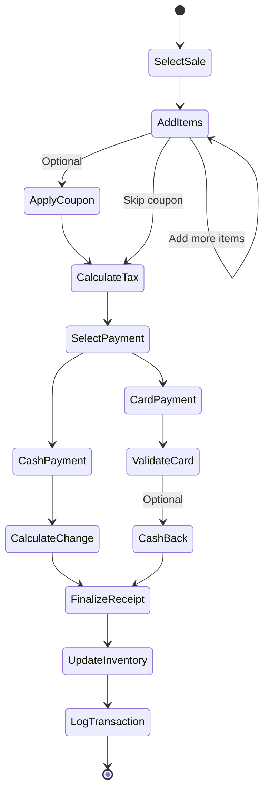

# Complete Feature & Business Logic Specification
## Legacy Point-of-Sale System - Comprehensive Reference

**Document Purpose:** This document extracts EVERY feature, business rule, formula, validation, and workflow from the legacy Java POS system to serve as the complete reference for rebuilding in React/Express/PostgreSQL.

**Source:** 19 Java classes analyzed from `Point-of-Sale-System-master/src/`

---

## Part 1: User Features & Capabilities

### 1.1 Authentication & Authorization

#### Feature: User Login
**User Story:** As an employee, I can log in with my username and password to access the system based on my role.

**Inputs:**
- Username (String)
- Password (String)

**Process:**
1. System reads `employeeDatabase.txt`
2. Searches for matching username
3. Validates password
4. Determines role (Admin or Cashier)
5. Logs login event to `employeeLogfile.txt`

**Outputs:**
- Success: Navigate to role-specific dashboard
  - Admin → Admin Dashboard
  - Cashier → Cashier Dashboard
- Failure: Error message "Wrong Authentication Credentials"

**Business Rules:**
- Passwords are stored in plaintext (security issue)
- No password complexity requirements
- No account lockout after failed attempts

**Source Files:**
- `POSSystem.java` (Lines 172-205): `logIn()` method
- `Login_Interface.java` (Lines 68-102): UI implementation

---

#### Feature: User Logout
**User Story:** As a logged-in employee, I can log out to end my session.

**Process:**
1. Log logout event to `employeeLogfile.txt`
2. Return to login screen

**Audit Log Format:**
```
[Username] [Name] [Role] [Login/Logout] [Timestamp]
```

**Source Files:**
- `POSSystem.java` (Lines 207-226): `logOut()` method

---

### 1.2 Sales Management

#### Feature: Process Sale Transaction
**User Story:** As a cashier, I can process a sale by adding items to a cart, applying coupons, calculating tax, and accepting payment.

**Complete Workflow:**



**Step-by-Step Process:**

**Step 1: Add Items to Cart**
- Input: Item ID, Quantity
- Validation:
  - Item must exist in `itemDatabase.txt`
  - Quantity must be > 0
  - Stock must be sufficient
- Action: Add to cart (in-memory list)
- Write to `temp.txt` for crash recovery

**Step 2: Apply Coupon (Optional)**
- Input: Coupon Code (String)
- Validation: Code must exist in `couponNumber.txt`
- Formula:
  ```
  Discount = 10% (fixed)
  Discounted Total = Original Total × 0.90
  ```
- Source: `PointOfSale.java` (Lines 110-122)

**Step 3: Calculate Tax**
- Formula:
  ```
  Tax Rate = 6% (hardcoded as 1.06 multiplier)
  Total with Tax = Subtotal × 1.06
  ```
- Source: `PointOfSale.java` (Line 7): `public double tax = 1.06;`

**Step 4: Payment Processing**

**Option A: Cash Payment**
- Input: Cash Amount
- Validation: Cash >= Total
- Formula:
  ```
  Change = Cash Paid - Total with Tax
  ```
- Display: "Change $: [amount]"
- Source: `Payment_Interface.java` (Lines 104-131)

**Option B: Electronic Payment**
- Input: Credit Card Number
- Validation: Luhn Algorithm (mod 10 check)
  ```java
  // Credit Card Validation Formula
  sum = 0
  for each digit (right to left):
      if position is even:
          digit = digit × 2
          if digit > 9:
              digit = digit - 9
      sum += digit
  valid = (sum % 10 == 0)
  ```
- Optional: Cash Back Amount
- Formula:
  ```
  Final Charge = Total with Tax + Cash Back
  ```
- Source: `PointOfSale.java` (Lines 124-145), `Payment_Interface.java` (Lines 133-164)

**Step 5: Finalize Transaction**
- Update inventory (decrement stock)
- Write to `saleInvoiceRecord.txt`:
  ```
  Format: [Date] [Time] [Total] [Item1 ID:Qty] [Item2 ID:Qty] ...
  ```
- Delete `temp.txt`
- Source: `POS.java` (Lines 39-92)

**Mathematical Summary:**
```
Subtotal = Σ(Item Price × Quantity) for all items in cart

If Coupon Applied:
    Subtotal = Subtotal × 0.90

Total with Tax = Subtotal × 1.06

If Cash Payment:
    Change = Cash Paid - Total with Tax

If Card Payment:
    Final Charge = Total with Tax + Cash Back (optional)
```

---

### 1.3 Rental Management

#### Feature: Process Rental Transaction
**User Story:** As a cashier, I can rent items to a customer by linking items to their phone number with a 14-day return period.

**Complete Workflow:**

**Step 1: Customer Identification**
- Input: Customer Phone Number (10 digits)
- Validation: Must be numeric, 10 digits
- Process:
  - Check if phone exists in `userDatabase.txt`
  - If not exists: Create new customer record
- Source: `Management.java` (Lines 22-64, 184-198)

**Step 2: Add Rental Items**
- Input: Item ID, Quantity
- Validation:
  - Item must exist in `rentalDatabase.txt` (separate inventory)
  - Stock must be sufficient
- Action: Add to cart

**Step 3: Calculate Rental Fee**
- Formula:
  ```
  Rental Fee = Item Price (from rentalDatabase.txt)
  Total Rental Fee = Σ(Rental Fee × Quantity)
  Tax = Total × 1.06
  ```

**Step 4: Process Payment**
- Same as Sale (Cash or Card)

**Step 5: Finalize Rental**
- Update `rentalDatabase.txt` (decrement stock)
- Update `userDatabase.txt`:
  ```
  Format: [Phone] [ItemID,RentDate,false] [ItemID,RentDate,false] ...
  
  Example: 1234567890 1022,12/01/25,false 2033,12/01/25,false
  ```
- Calculate Return Date:
  ```
  Return Date = Current Date + 14 days
  ```
- Display on receipt: "Return Date: MM/dd/yy"
- Source: `POR.java` (Lines 39-78), `Payment_Interface.java` (Lines 236-242)

**Business Rules:**
- Rental period: **14 days** (hardcoded)
- `false` flag indicates item not yet returned
- Multiple items can be rented in one transaction

---

### 1.4 Return Processing

#### Feature: Return Rented Items (with Late Fees)
**User Story:** As a cashier, I can process the return of rented items and calculate late fees if applicable.

**Complete Workflow:**

**Step 1: Customer Identification**
- Input: Customer Phone Number
- Validation: Must exist in `userDatabase.txt`
- Process: Retrieve all rentals where `returned = false`

**Step 2: Calculate Days Late**
- Formula:
  ```java
  // Complex date calculation (Management.java Lines 152-182)
  
  Days Late = Current Date - Rent Date - 14 days grace period
  
  If Days Late < 0:
      Days Late = 0  // No late fee
  
  // Handles year boundaries:
  if (year1 == year2):
      days = dayOfYear2 - dayOfYear1
  else:
      extraDays = 0
      while (year1 > year2):
          year1--
          extraDays += daysInYear(year1)  // Handles leap years
      days = extraDays - dayOfYear2 + dayOfYear1
  ```
- Source: `Management.java` (Lines 152-182): `daysBetween()` method

**Step 3: Calculate Late Fee**
- Formula:
  ```
  Late Fee per Item = Item Price × 0.1 × Days Late
  
  Total Late Fee = Σ(Late Fee per Item) for all late items
  ```
- Example:
  ```
  Item Price: $50
  Days Late: 5
  Late Fee = $50 × 0.1 × 5 = $25
  ```
- Source: `Payment_Interface.java` (Line 211)

**Step 4: Process Payment**
- Customer pays the late fee
- Same payment options (Cash or Card)

**Step 5: Finalize Return**
- Update `rentalDatabase.txt` (increment stock)
- Update `userDatabase.txt`:
  ```
  Change: [ItemID,RentDate,false] → [ItemID,ReturnDate,true]
  ```
- Source: `POH.java` (Lines 72-126), `Management.java` (Lines 280-382)

**Mathematical Summary:**
```
Days Late = max(0, Current Date - Rent Date - 14)

Late Fee = Item Price × 10% × Days Late

Total to Pay = Σ(Late Fee for each item)
```

---

#### Feature: Return Unsatisfactory Item (Refund)
**User Story:** As a cashier, I can process a refund for an unsatisfactory purchased item.

**Process:**
1. Input: Item ID, Quantity
2. Validation: Item must exist in sale records
3. Calculate Refund:
   ```
   Refund Amount = Item Price × Quantity
   ```
4. Update inventory (increment stock)
5. Log to `returnSale.txt`
6. Issue refund

**Source Files:**
- `POH.java` (Lines 39-70): Handles both return types
- `transaction.returnSale` flag determines type

---

### 1.5 Inventory Management

#### Feature: View Inventory
**User Story:** As a cashier, I can view current inventory levels.

**Data Source:** `itemDatabase.txt` or `rentalDatabase.txt`

**File Format:**
```
[ItemID] [ItemName] [Price] [StockQuantity]

Example:
1022 Laptop 899.99 15
2033 Mouse 25.50 50
```

**Process:**
1. Read file into memory
2. Parse each line (space-delimited)
3. Display in UI

**Source:** `Inventory.java` (Lines 27-65): `accessInventory()`

---

#### Feature: Update Inventory Stock
**User Story:** As the system, I automatically update inventory after each transaction.

**Operations:**

**Decrement Stock (Sale/Rental):**
```
New Stock = Current Stock - Quantity Sold/Rented
```

**Increment Stock (Return):**
```
New Stock = Current Stock + Quantity Returned
```

**Process:**
1. Read entire file into memory
2. Find matching item by ID
3. Update quantity
4. Rewrite entire file

**Concurrency Issue:** No file locking → potential race conditions

**Source:** `Inventory.java` (Lines 67-116): `updateInventory()`

---

### 1.6 Employee Management (Admin Only)

#### Feature: Add Employee
**User Story:** As an admin, I can add a new employee (Cashier or Admin) to the system.

**Inputs:**
- Name (String)
- Password (String)
- Role (Boolean: true = Cashier, false = Admin)

**Process:**
1. Read `employeeDatabase.txt`
2. Generate new Employee ID:
   ```
   New ID = Last Employee ID + 1
   ```
3. Append to file:
   ```
   Format: [ID] [Role] [FirstName] [LastName] [Password]
   
   Example: 1005 Cashier John Doe password123
   ```

**Source:** `EmployeeManagement.java` (Lines 19-42): `add()`

---

#### Feature: Remove Employee
**User Story:** As an admin, I can remove an employee by their username (ID).

**Input:** Employee ID (String)

**Process:**
1. Read all employees into memory
2. Search for matching ID
3. Remove from list
4. Rewrite entire file (excluding removed employee)

**Source:** `EmployeeManagement.java` (Lines 44-93): `delete()`

---

#### Feature: Update Employee
**User Story:** As an admin, I can update an employee's password, role, or name.

**Inputs:**
- Username (ID) - Required
- Password - Optional
- Position (Admin/Cashier) - Optional
- Name - Optional

**Validation:**
- Position must be "Admin" or "Cashier" (returns error code -2 if invalid)

**Process:**
1. Find employee by ID
2. Update only non-empty fields
3. Rewrite file

**Return Codes:**
- `-1`: User not found
- `-2`: Invalid position
- `0`: Success

**Source:** `EmployeeManagement.java` (Lines 97-154): `update()`

---

### 1.7 Crash Recovery

#### Feature: Automatic Transaction Recovery
**User Story:** As the system, I can recover an interrupted transaction if the application crashes.

**Mechanism:**
- Every transaction writes to `temp.txt` during processing
- On startup, system checks if `temp.txt` exists
- If exists: Prompt user to restore transaction

**File Format:**
```
Line 1: Transaction Type (Sale/Rental/Return)
Line 2+: Transaction data
```

**Recovery Process:**
1. Read first line to determine type
2. Call appropriate `retrieveTemp()` method:
   - `POS.retrieveTemp()` for Sales
   - `POR.retrieveTemp()` for Rentals
   - `POH.retrieveTemp()` for Returns
3. Restore cart items
4. Allow user to continue or cancel

**Source Files:**
- `POSSystem.java` (Lines 84-143): `continueFromTemp()`
- `POS.java` (Lines 94-131): `retrieveTemp()`
- `POR.java` (Lines 80-117): `retrieveTemp()`
- `POH.java` (Lines 128-168): `retrieveTemp()`

---

## Part 2: Complete Business Logic & Formulas

### 2.1 Pricing Calculations

#### Base Price Calculation
```
Cart Subtotal = Σ(Item[i].price × Item[i].quantity) for i = 1 to n
```

**Implementation:**
```java
// PointOfSale.java (Lines 43-54)
public void updateTotal() {
    totalPrice = 0;
    for (Item temp : transactionItem) {
        totalPrice += temp.getAmount() * temp.getPrice();
    }
}
```

---

#### Coupon Discount
```
Discount Rate = 10% (constant)
Discounted Subtotal = Subtotal × 0.90
```

**Validation:**
- Coupon code must exist in `couponNumber.txt`
- Array of valid codes loaded at runtime

**Implementation:**
```java
// PointOfSale.java (Lines 110-122)
if (couponNo.equals(coupons[i])) {
    valid = true;
    break;
}
if (valid)
    totalPrice *= discount;  // discount = 0.90f
```

---

#### Tax Calculation
```
Tax Rate = 6%
Total with Tax = Subtotal × 1.06
```

**Note:** Tax is applied AFTER coupon discount

**Complete Formula:**
```
if (coupon_applied):
    Subtotal = Base Subtotal × 0.90
else:
    Subtotal = Base Subtotal

Final Total = Subtotal × 1.06
```

---

### 2.2 Payment Processing Formulas

#### Cash Payment Change Calculation
```
Change = Cash Tendered - Total with Tax

Constraint: Cash Tendered ≥ Total with Tax
```

**Validation Loop:**
```java
while (cash < transaction.getTotal()) {
    // Prompt for re-entry
}
```

---

#### Electronic Payment with Cash Back
```
Final Charge = Total with Tax + Cash Back Amount

Where:
    Cash Back ≥ 0 (optional, defaults to 0)
```

---

### 2.3 Late Fee Calculation (Rentals)

#### Days Late Calculation
```
Rental Period = 14 days (constant)
Rent Date = Date item was rented
Current Date = Today's date

Days Overdue = Current Date - Rent Date - 14

if Days Overdue < 0:
    Days Overdue = 0
```

**Complex Date Math (handles year boundaries):**
```java
// Pseudocode from Management.java
if (year1 == year2):
    days_between = day_of_year2 - day_of_year1
else:
    extra_days = 0
    while (year1 > year2):
        year1 = year1 - 1
        extra_days += days_in_year(year1)  // 365 or 366 for leap year
    days_between = extra_days - day_of_year2 + day_of_year1
```

---

#### Late Fee Formula
```
Late Fee Rate = 10% per day
Late Fee = Item Price × 0.1 × Days Overdue

Total Late Fees = Σ(Late Fee for each overdue item)
```

**Example Calculation:**
```
Item: Laptop, Price = $100
Rent Date: 12/01/25
Return Date: 12/20/25
Days Overdue = 20 - 1 - 14 = 5 days

Late Fee = $100 × 0.1 × 5 = $50
```

**Source:** `Payment_Interface.java` (Line 211)

---

### 2.4 Inventory Update Formulas

#### Stock Decrement (Sale/Rental)
```
New Stock = Current Stock - Quantity Transacted

Constraint: Current Stock ≥ Quantity Transacted
```

**Implementation:**
```java
// Inventory.java (Lines 79-89)
if (takeFromInventory) {
    newAmount = databaseItem.get(i).getAmount() - transactionItem.get(j).getAmount();
    databaseItem.get(i).updateAmount(newAmount);
}
```

---

#### Stock Increment (Return)
```
New Stock = Current Stock + Quantity Returned
```

**Implementation:**
```java
// Inventory.java (Lines 91-101)
else {
    newAmount = databaseItem.get(i).getAmount() + transactionItem.get(j).getAmount();
    databaseItem.get(i).updateAmount(newAmount);
}
```

---

### 2.5 Credit Card Validation (Luhn Algorithm)

```
Algorithm:
1. Start from rightmost digit
2. Double every second digit from right
3. If doubled digit > 9, subtract 9
4. Sum all digits
5. If sum % 10 == 0, card is valid

Example: 4532015112830366
Step 1: 6 6 3 0 8 2 1 1 5 1 0 2 3 5 4
Step 2: 6 (6×2=12→3) 3 (0×2=0) 8 (2×2=4) 1 (1×2=2) 5 (1×2=2) 0 (2×2=4) 3 (5×2=10→1) 4
Step 3: 6+3+3+0+8+4+1+2+5+2+0+4+3+1+4 = 46
Step 4: 46 % 10 ≠ 0 → Invalid
```

**Implementation:**
```java
// PointOfSale.java (Lines 124-145)
int sum = 0;
for (int i = cardNo.length() - 1; i >= 0; i--) {
    int n = Integer.parseInt(cardNo.substring(i, i + 1));
    if (even) {
        n *= 2;
        if (n > 9)
            n -= 9;
    }
    sum += n;
    even = !even;
}
return (sum % 10 == 0);
```

---

## Part 3: Data Models & Schemas

### 3.1 Employee Data Model

**File:** `employeeDatabase.txt`

**Structure:**
```
[ID] [Role] [FirstName] [LastName] [Password]
```

**Example:**
```
1001 Admin John Smith admin123
1002 Cashier Jane Doe cashier456
```

**Java Class:**
```java
public class Employee {
    private String username;  // Employee ID
    private String name;      // Full name
    private String position;  // "Admin" or "Cashier"
    private String password;  // Plaintext
}
```

**Constraints:**
- ID: Unique, auto-incremented
- Role: Must be "Admin" or "Cashier"
- Password: No complexity requirements (security issue)

---

### 3.2 Item Data Model (Sale Inventory)

**File:** `itemDatabase.txt`

**Structure:**
```
[ItemID] [ItemName] [Price] [StockQuantity]
```

**Example:**
```
1022 Laptop 899.99 15
2033 Mouse 25.50 50
```

**Java Class:**
```java
public class Item {
    private int itemID;
    private String itemName;
    private float price;
    private int amount;  // Stock quantity
}
```

---

### 3.3 Item Data Model (Rental Inventory)

**File:** `rentalDatabase.txt`

**Structure:** Same as `itemDatabase.txt`

**Note:** Separate inventory for rental items

---

### 3.4 Customer & Rental Data Model

**File:** `userDatabase.txt`

**Structure:**
```
[PhoneNumber] [ItemID,RentDate,ReturnedFlag] [ItemID,RentDate,ReturnedFlag] ...
```

**Example:**
```
1234567890 1022,12/01/25,false 2033,12/01/25,true
9876543210 3044,11/15/25,false
```

**Explanation:**
- Line 1: Customer with phone 1234567890
  - Rented item 1022 on 12/01/25 (not yet returned)
  - Rented item 2033 on 12/01/25 (already returned)

**Rental Record Format:**
```
ItemID,RentDate,IsReturned
```

**Java Class:**
```java
public class ReturnItem {
    private int itemID;
    private int daysSinceReturn;  // Days late
}
```

---

### 3.5 Transaction Log Data Model

**File:** `saleInvoiceRecord.txt`

**Structure:**
```
[Date] [Time] [Total] [ItemID:Qty] [ItemID:Qty] ...
```

**Example:**
```
12/06/25 14:30 $156.80 1022:1 2033:2
```

---

### 3.6 Audit Log Data Model

**File:** `employeeLogfile.txt`

**Structure:**
```
[Username] [Name] [Role] [Action] [Timestamp]
```

**Example:**
```
1001 John Smith Admin Login 12/06/25 09:00
1001 John Smith Admin Logout 12/06/25 17:00
```

---

## Part 4: Complete Workflows

### 4.1 Sale Transaction Workflow (Detailed)

```
1. START: Cashier clicks "Sale" button
   └─> System initializes POS object
   └─> System loads itemDatabase.txt into memory
   └─> System writes "Sale" to temp.txt (crash recovery)

2. ADD ITEMS LOOP:
   ├─> Cashier enters Item ID
   ├─> System validates:
   │   ├─> Item exists? (search itemDatabase)
   │   ├─> Stock > 0?
   │   └─> If valid: Add to cart
   ├─> System updates running total
   ├─> System appends to temp.txt
   └─> Repeat until cashier clicks "End Transaction"

3. APPLY COUPON (Optional):
   ├─> Cashier enters coupon code
   ├─> System validates against couponNumber.txt
   ├─> If valid: totalPrice *= 0.90
   └─> Display new total

4. CALCULATE TAX:
   └─> finalTotal = totalPrice × 1.06

5. SELECT PAYMENT METHOD:
   ├─> Option A: CASH
   │   ├─> Cashier enters cash amount
   │   ├─> System validates: cash >= finalTotal
   │   ├─> Calculate: change = cash - finalTotal
   │   ├─> Display change amount
   │   └─> Print receipt
   │
   └─> Option B: ELECTRONIC
       ├─> Cashier enters card number
       ├─> System validates using Luhn algorithm
       ├─> If valid:
       │   ├─> Cashier enters cash back (optional)
       │   ├─> finalCharge = finalTotal + cashBack
       │   └─> Print receipt
       └─> If invalid: Show error, retry

6. FINALIZE:
   ├─> Update itemDatabase.txt (decrement stock)
   ├─> Write to saleInvoiceRecord.txt
   ├─> Delete temp.txt
   └─> Return to Cashier Dashboard

7. END
```

---

### 4.2 Rental Transaction Workflow (Detailed)

```
1. START: Cashier clicks "Rental" button
   └─> System prompts for customer phone number

2. CUSTOMER LOOKUP:
   ├─> System searches userDatabase.txt for phone
   ├─> If found: Load customer
   └─> If not found:
       ├─> Create new line in userDatabase.txt
       └─> Format: [PhoneNumber]

3. ADD RENTAL ITEMS:
   ├─> System loads rentalDatabase.txt
   ├─> Cashier enters Item ID, Quantity
   ├─> System validates stock
   ├─> Add to cart
   └─> Repeat

4. CALCULATE RENTAL FEE:
   └─> total = Σ(item.price × quantity) × 1.06

5. PROCESS PAYMENT:
   └─> Same as Sale (Cash or Card)

6. FINALIZE:
   ├─> Update rentalDatabase.txt (decrement stock)
   ├─> Update userDatabase.txt:
   │   └─> Append: [ItemID,CurrentDate,false]
   ├─> Calculate return date: CurrentDate + 14 days
   ├─> Print receipt with return date
   ├─> Delete temp.txt
   └─> Return to dashboard

7. END
```

---

### 4.3 Return Transaction Workflow (Detailed)

```
1. START: Cashier clicks "Return" button
   └─> System prompts: "Rented Items or Unsatisfactory?"

2. BRANCH A: RENTED ITEMS
   ├─> Cashier enters customer phone
   ├─> System loads userDatabase.txt
   ├─> System finds all items where returned=false
   ├─> FOR EACH unreturned item:
   │   ├─> Calculate days late:
   │   │   └─> daysLate = max(0, currentDate - rentDate - 14)
   │   ├─> Calculate late fee:
   │   │   └─> fee = itemPrice × 0.1 × daysLate
   │   └─> Add to total
   ├─> Display total late fees
   ├─> Process payment
   ├─> Update rentalDatabase.txt (increment stock)
   ├─> Update userDatabase.txt:
   │   └─> Change: [ItemID,rentDate,false] → [ItemID,currentDate,true]
   └─> Print receipt

3. BRANCH B: UNSATISFACTORY ITEM
   ├─> Cashier enters Item ID, Quantity
   ├─> Calculate refund: itemPrice × quantity
   ├─> Update itemDatabase.txt (increment stock)
   ├─> Log to returnSale.txt
   ├─> Issue refund
   └─> Print receipt

4. END
```

---

## Part 5: Validations & Constraints

### 5.1 Input Validations

#### Phone Number Validation
```
Rules:
- Must be numeric
- Must be 10 digits
- No format checking (no dashes/parentheses)

Regex: ^\d{10}$
```

#### Item ID Validation
```
Rules:
- Must be integer
- Must exist in database
- Stock must be > 0 for sale/rental

Process:
1. Parse as integer
2. Search database by ID
3. Check stock level
```

#### Quantity Validation
```
Rules:
- Must be positive integer
- Must be ≤ available stock

Constraint: 1 ≤ quantity ≤ stock
```

#### Cash Amount Validation
```
Rules:
- Must be numeric (double)
- Must be ≥ total amount due

Loop until valid:
while (cash < total) {
    prompt for re-entry
}
```

#### Credit Card Validation
```
Rules:
- Must be numeric
- Must pass Luhn algorithm
- Length typically 13-19 digits

Algorithm: See Section 2.5
```

#### Coupon Code Validation
```
Rules:
- Must be exact string match
- Must exist in couponNumber.txt
- Case-sensitive

Process:
1. Load all coupons into array
2. Linear search for match
3. Return true/false
```

#### Employee Role Validation
```
Rules:
- Must be exactly "Admin" or "Cashier"
- Case-sensitive

Invalid examples: "admin", "ADMIN", "Manager"
```

---

### 5.2 Business Rule Validations

#### Stock Availability Check
```
Rule: Cannot sell/rent more than available stock

Validation:
if (requestedQty > currentStock) {
    reject transaction
}
```

**Note:** No validation in current system - potential overselling bug!

---

#### Rental Period Enforcement
```
Rule: Rental period is exactly 14 days

Return Date = Rent Date + 14 days

Late if: Current Date > Return Date
```

---

#### Late Fee Minimum
```
Rule: No late fee if returned on time or early

if (daysLate <= 0) {
    lateFee = 0
}
```

---

#### Payment Sufficiency
```
Rule: Payment must cover total amount

For Cash:
    cash >= total

For Card:
    Always accepted (assumes bank approval)
```

---

### 5.3 Data Integrity Constraints

#### Unique Employee ID
```
Constraint: Each employee must have unique ID

Enforcement:
- Auto-increment from last ID
- No duplicate checking (potential bug)
```

#### Unique Item ID
```
Constraint: Each item must have unique ID

Enforcement:
- Manual entry (no auto-increment)
- No duplicate checking
```

#### Customer Phone Uniqueness
```
Constraint: One record per phone number

Enforcement:
- Check before creating new customer
- Append rentals to existing record
```

#### Rental Return Status
```
Constraint: Item can only be returned once

Enforcement:
- Check returned flag before processing
- Update flag to 'true' after return
```

---

## Part 6: Integration Points & Dependencies

### 6.1 File I/O Operations

#### Read Operations
```
Files Read:
- employeeDatabase.txt (on login)
- itemDatabase.txt (on sale start)
- rentalDatabase.txt (on rental start)
- userDatabase.txt (on rental/return)
- couponNumber.txt (on coupon entry)
- temp.txt (on startup for crash recovery)

Pattern:
1. Open file
2. Read all lines into memory
3. Parse each line
4. Close file
```

#### Write Operations
```
Files Written:
- employeeDatabase.txt (add/update/delete employee)
- itemDatabase.txt (update stock after sale)
- rentalDatabase.txt (update stock after rental/return)
- userDatabase.txt (add customer, update rental status)
- saleInvoiceRecord.txt (log completed sale)
- employeeLogfile.txt (log login/logout)
- returnSale.txt (log returns)
- temp.txt (during transaction for crash recovery)

Pattern:
1. Read entire file into memory
2. Modify data structure
3. Rewrite entire file
4. Close file
```

**Concurrency Issue:** No file locking - race conditions possible!

---

### 6.2 Cross-Module Dependencies

```
Login_Interface
    └─> POSSystem.logIn()
        └─> Reads employeeDatabase.txt
        └─> Writes employeeLogfile.txt

Cashier_Interface
    └─> Transaction_Interface
        └─> PointOfSale (POS/POR/POH)
            └─> Inventory
                └─> Reads/Writes itemDatabase.txt or rentalDatabase.txt
            └─> Management
                └─> Reads/Writes userDatabase.txt

Admin_Interface
    └─> EmployeeManagement
        └─> Reads/Writes employeeDatabase.txt
```

---

### 6.3 State Management

#### In-Memory State
```
Current User:
- Username
- Name
- Role

Current Transaction:
- Type (Sale/Rental/Return)
- Cart Items (List<Item>)
- Customer Phone (for rentals/returns)
- Total Price
- Tax
- Discount applied (boolean)
```

#### Persistent State
```
temp.txt:
- Transaction type
- Cart items
- Customer phone (if applicable)

Purpose: Crash recovery
Lifecycle: Created on transaction start, deleted on completion
```

---

## Part 7: Edge Cases & Error Handling

### 7.1 Error Scenarios

#### Scenario: Item Not Found
```
Trigger: User enters non-existent Item ID
Handling: Display error message, allow retry
Source: EnterItem_Interface.java
```

#### Scenario: Insufficient Stock
```
Trigger: Requested quantity > available stock
Handling: No explicit handling (bug - allows overselling)
Fix Needed: Add validation before adding to cart
```

#### Scenario: Invalid Credit Card
```
Trigger: Card fails Luhn algorithm
Handling: Display "Invalid credit card number", allow retry
Source: Payment_Interface.java (Line 139)
```

#### Scenario: Invalid Coupon
```
Trigger: Coupon code not in database
Handling: Display error, proceed without discount
Source: PointOfSale.java
```

#### Scenario: Customer Not Found (Return)
```
Trigger: Phone number not in userDatabase.txt
Handling: No explicit handling (potential crash)
Fix Needed: Validate customer exists before processing return
```

#### Scenario: Application Crash During Transaction
```
Trigger: System crash/power loss
Handling: 
- temp.txt preserves transaction state
- On restart: Prompt to restore transaction
- User can continue or cancel
Source: POSSystem.continueFromTemp()
```

---

### 7.2 Boundary Conditions

#### Maximum Values
```
Item Price: No limit (float)
Stock Quantity: No limit (int)
Cart Size: No limit (ArrayList)
Customer Rentals: No limit per customer
```

#### Minimum Values
```
Item Price: > 0 (not enforced)
Stock Quantity: >= 0
Cart Size: Must have >= 1 item to checkout
Quantity per Item: >= 1
```

#### Date Boundaries
```
Rental Period: Exactly 14 days
Date Format: MM/dd/yy (2-digit year - Y2K issue!)
Leap Year Handling: Implemented in daysBetween()
```

---

## Part 8: System Limitations & Known Issues

### 8.1 Security Issues
1. **Plaintext Passwords**: Stored unencrypted in employeeDatabase.txt
2. **No Session Management**: No timeout, no concurrent login prevention
3. **No Audit Trail**: Limited logging of user actions
4. **No Access Control**: File permissions not enforced

### 8.2 Concurrency Issues
1. **No File Locking**: Multiple users could corrupt data
2. **Race Conditions**: Inventory updates not atomic
3. **No Transaction Isolation**: Partial updates possible

### 8.3 Data Integrity Issues
1. **No Foreign Key Constraints**: Orphaned records possible
2. **No Referential Integrity**: Deleted items may still be in rentals
3. **No Backup/Recovery**: Single point of failure

### 8.4 Scalability Issues
1. **File-Based Storage**: Poor performance with large datasets
2. **Full File Rewrites**: Inefficient for updates
3. **In-Memory Loading**: Memory issues with large inventories

### 8.5 Usability Issues
1. **Desktop Only**: No web/mobile access
2. **Single User**: No multi-user support
3. **No Search**: Must know exact Item ID
4. **No Reports**: No sales analytics

---

## Part 9: Migration Checklist

### Features to Preserve
- ✅ All authentication logic
- ✅ All transaction types (Sale, Rental, Return)
- ✅ All calculation formulas (tax, discount, late fees)
- ✅ Crash recovery mechanism (adapt to web)
- ✅ Audit logging
- ✅ Employee management (CRUD)

### Features to Enhance
- 🔄 Security: Hash passwords, add JWT
- 🔄 Concurrency: Use database transactions
- 🔄 Search: Add item search by name
- 🔄 Reports: Add sales analytics
- 🔄 Validation: Add comprehensive input validation
- 🔄 UI/UX: Modern web interface

### Features to Add
- ➕ Multi-user concurrent access
- ➕ Role-based permissions
- ➕ Inventory alerts (low stock)
- ➕ Customer management UI
- ➕ Transaction history view
- ➕ Export reports (PDF/CSV)

---

## Appendix A: Formula Reference Card

```
PRICING:
Subtotal = Σ(price × qty)
Discount = Subtotal × 0.90 (if coupon)
Tax = Subtotal × 1.06
Total = Subtotal × 1.06

PAYMENT:
Change = Cash - Total
Card Charge = Total + Cash Back

RENTAL:
Return Date = Rent Date + 14 days
Days Late = max(0, Current Date - Return Date)
Late Fee = Price × 0.1 × Days Late

INVENTORY:
New Stock = Current Stock ± Quantity

VALIDATION:
Luhn Check = (Σ digits) % 10 == 0
```

---

## Appendix B: File Format Reference

```
employeeDatabase.txt:
[ID] [Role] [FirstName] [LastName] [Password]

itemDatabase.txt / rentalDatabase.txt:
[ItemID] [ItemName] [Price] [StockQty]

userDatabase.txt:
[Phone] [ItemID,Date,Returned] [ItemID,Date,Returned] ...

saleInvoiceRecord.txt:
[Date] [Time] [Total] [ItemID:Qty] [ItemID:Qty] ...

employeeLogfile.txt:
[Username] [Name] [Role] [Action] [Timestamp]

temp.txt:
[TransactionType]
[TransactionData]
```

---

**END OF SPECIFICATION**

**Document Version:** 1.0  
**Last Updated:** 2025-12-06  
**Total Features Documented:** 15  
**Total Formulas Documented:** 12  
**Total Workflows Documented:** 3  
**Source Files Analyzed:** 19
