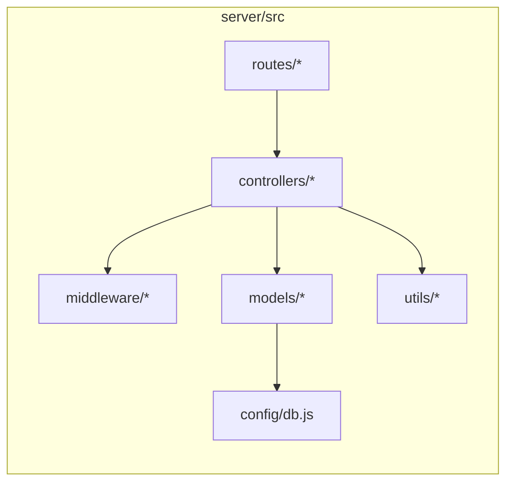
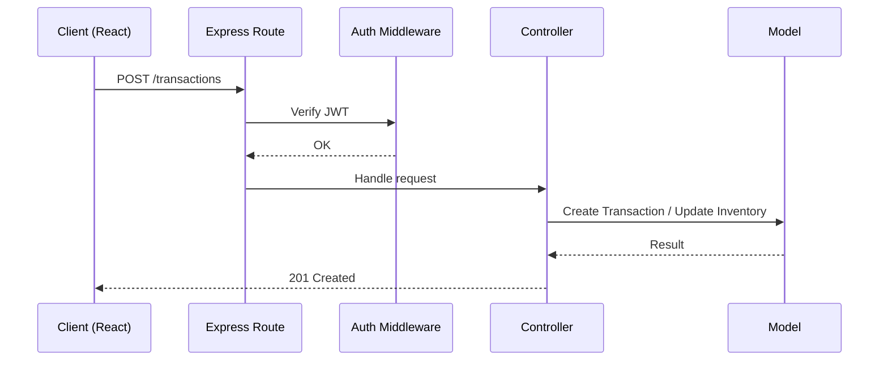

# Architecture Overview

This document summarizes the improved architecture with clear layers, tech stack rationale, and modular design for maintainability.

## Layered Architecture

- Presentation (Client): React + Vite SPA, role-based UI.
- API (Server): Express.js REST API with controllers, routes, middleware.
- Domain/Business: Pricing utilities, ID generation, transaction logic.
- Data Access: Mongoose models and DB config.

### Layered View (Mermaid)

```mermaid
flowchart TB
  subgraph Client [Client (Presentation)]
    A[React + Vite]
    B[Auth Context / Protected Routes]
  end

  subgraph Server [Server (API + Domain)]
    C[Express App]
    D[Routes]
    E[Controllers]
    F[Middleware]
    G[Business Utils]
    H[Models]
    I[DB Config]
  end

  J[(MongoDB)]

  A --> C
  B --> C
  C --> D --> E --> H
  E --> F
  E --> G
  H --> I
  H --> J
```

## Tech Stack Justification

- React + Vite: fast dev experience, modern tooling, modular components.
- Express.js: lightweight, familiar REST framework with clear controller/route separation.
- Mongoose + MongoDB: flexible document model for POS data, rapid iteration, embedded rentals.
- Jest: server-side tests for pricing and auth integration.

## Modularity & Maintainability

- Separation of concerns: `controllers/`, `routes/`, `middleware/`, `models/`, `utils/`.
- Clear contracts: routes only call controllers; controllers orchestrate models and utils.
- Config-driven: database URI and constants centralized under `server/src/config/`.
- Testable units: pricing logic (`server/src/utils/pricing.js`) and auth flows covered by tests.
- Minimal coupling: UI consumes REST endpoints; server hides data details behind controllers.

### Module Dependency Map (Mermaid)



## Request Lifecycle

- Client sends authenticated request with JWT.
- Express verifies auth via middleware, routes to controller.
- Controller validates input, applies business utils, interacts with models.
- Response returned with standardized error handling.

### Sequence (Mermaid)



## Practices Ensuring Maintainability

- Linting and testing with Jest (see `server/jest.config.js`).
- Clear error handling via `server/src/middleware/errorHandler.js`.
- Seed scripts for repeatable environments (`server/src/seeds/seed.js`).
- Feature specs in `COMPLETE_FEATURE_AND_BUSINESS_LOGIC_SPECIFICATION.md` to guide implementation.
