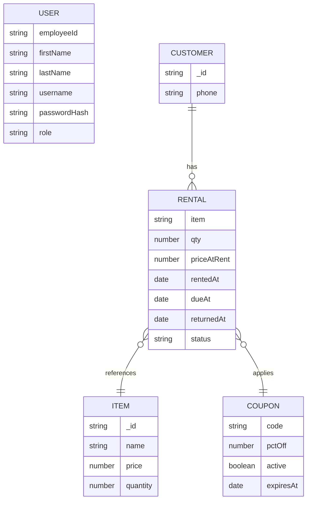

# Data Restructuring & Migration

Responsible: Member C (Schema Design), Member B (Migration Execution)

## 4.1 Proposed Database Schema

- Schema Design:
  - `User`: `employeeId`, `firstName`, `lastName`, `username`, `passwordHash`, `role`.
  - `Item`: `name`, `price`, `quantity`.
  - `Coupon`: `code`, `pctOff` (0-1), `active`, `expiresAt` (optional).
  - `Customer`: `phone` (unique), `rentals` (embedded array linking `Item` with rental metadata).
  - `Rental` (embedded in `Customer`): `item` (ref `Item`), `qty`, `priceAtRent`, `rentedAt`, `dueAt`, `returnedAt`, `status`.

- Evidence:
  - Models in `server/src/models/`: `User.js`, `Item.js`, `Coupon.js`, `Customer.js`.
  - Role constants in `server/src/config/constants.js`.

- Justification:
  - Normalizes operational entities (users, items, coupons) while embedding time-bound rentals under a customer for fast access to customer history.
  - Enforces uniqueness where required (`employeeId`, `username`, `coupon code`, `customer phone`).
  - Keeps transactional pricing snapshots (`priceAtRent`) within rentals to preserve historical accuracy.
  - Minimizes joins by referencing `Item` only from rentals; other reads remain document-local.

### Schema Visualization (Mermaid)



## 4.2 Data Migration Execution (ETL)

- Migration Strategy:
  - Source: legacy text files under `old db files/` (`employeeDatabase.txt`, `itemDatabase.txt`, `couponNumber.txt`, `userDatabase.txt`).
  - Transform: parse line-oriented records, sanitize types, apply defaults where legacy data is incomplete.
  - Load: insert into MongoDB via Mongoose after clearing collections to avoid duplicates.
  - Id Mapping: legacy item IDs are not preserved; rentals currently omit linking in seed due to missing mapping. Future step: build a mapping table from legacy item ID → new `Item._id`.

- Evidence of Success:
  - Seed script `server/src/seeds/seed.js` prints counts for employees, items, coupons, customers.
  - Default fallbacks are used when legacy files are missing; console output notes fallbacks and totals.

- Script Snippet (Parsing Logic):
  - From `server/src/seeds/seed.js` — item database parsing and normalization:

```js
function readItemDatabase() {
  try {
    const filePath = path.join(__dirname, '../../../old db files/itemDatabase.txt');
    const content = fs.readFileSync(filePath, 'utf-8');
    const lines = content.trim().split('\n');
    return lines.map((line) => {
      const [id, name, price, quantity] = line.trim().split(' ');
      return {
        name: name || `Item-${id}`,
        price: parseFloat(price) || 0,
        quantity: parseInt(quantity, 10) || 0,
      };
    });
  } catch (err) {
    return [
      { name: 'Laptop Sleeve', price: 25, quantity: 20 },
      { name: 'USB-C Cable', price: 10, quantity: 50 },
      { name: 'Mechanical Keyboard', price: 120, quantity: 5 },
    ];
  }
}
```

- How to Run:
  - Ensure `MONGO_URI` is set (see `server/.env.example`).
  - Install and run seed:

```bash
cd server
npm install
MONGO_URI="mongodb://localhost:27017/sre-pos" node src/seeds/seed.js
```
